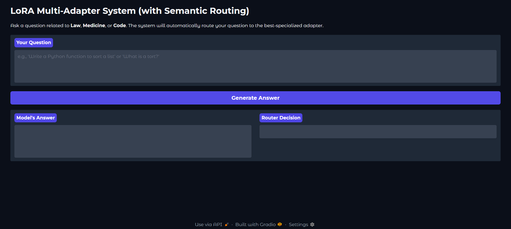
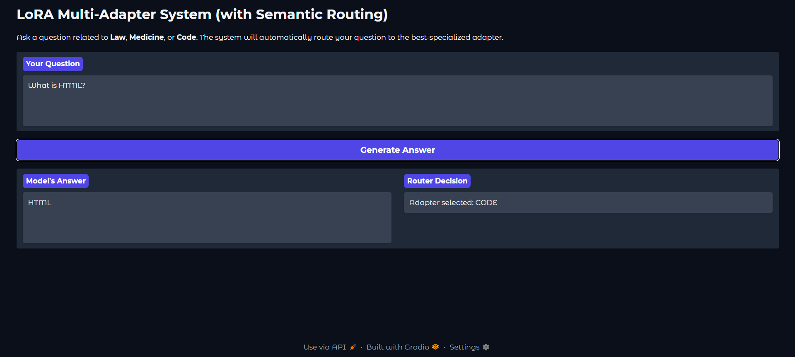
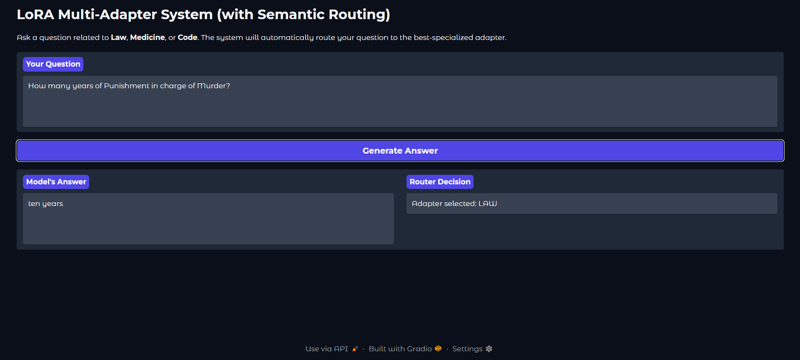
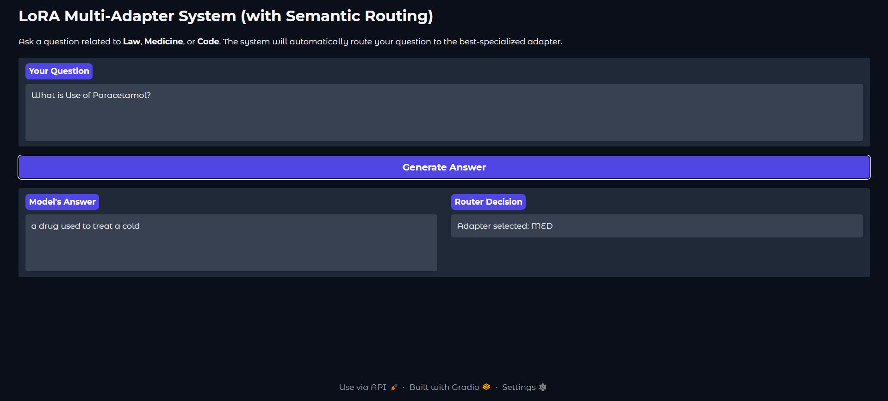

<div align="center">

# 🧠 LoRA Multi-Adapter System 🧠

### An Intelligent, Multi-Domain Chatbot with Dynamic Adapter Routing



</div>

<p align="center">
  
  
  
  
</p>

---

This project is a complete, end-to-end system for fine-tuning, evaluating, and serving a single base language model augmented with multiple specialized **LoRA (Low-Rank Adaptation)** adapters. The system features a sophisticated **semantic router** that analyzes user prompts to dynamically select the most appropriate adapter for tasks in different domains: **Law**, **Medicine**, and **Code**.

This repository showcases the full lifecycle of a modern NLP project, demonstrating a robust and scalable architecture for multi-task, parameter-efficient fine-tuning.

## ## Key Features ✨

| Feature | Description |
| :--- | :--- |
| **Multi-Domain Expertise** | A single base model (`google/flan-t5-base`) handles multiple specialized tasks, saving significant resources. |
| **Efficient LoRA Fine-Tuning**| Uses LoRA to train lightweight adapters instead of full models, making training fast and accessible. |
| **Semantic Routing** | An intelligent router uses a `sentence-transformer` model to understand the *meaning* of a prompt and select the best adapter based on semantic similarity. |
| **Interactive Web UI** | Built with Gradio to provide a user-friendly and shareable interface for interacting with the complete system. |
| **Full ML Pipeline** | Includes modular scripts for training, evaluation (calculating BLEU and Exact Match scores), and live inference. |
| **Configurable** | Project settings like model names, training parameters, and adapter paths are managed via YAML files. |

---
## ## Live Application Screenshots

The system's user interface, built with Gradio, allows for seamless interaction. The router's decision is displayed alongside the generated answer, providing transparency into the system's logic.

| **Code Query** | **Law Query** | **Medical Query** |
| :---: | :---: | :---: |
|  |  |  |

---
## ## Project Status & Evaluation

This project serves as a proof-of-concept demonstrating the full architecture. The adapters have been intentionally trained on a **very small dataset** to ensure the pipeline is functional without requiring extensive computational resources.

* **Training Data:** 10 samples per domain.
* **Evaluation Data:** 5 samples per domain.

Due to the limited training, the model's performance is currently at a baseline level, which is expected. This is reflected in the evaluation scores for the 'law' adapter:

* **Exact Match:** `0.00`
* **BLEU Score:** `0.30`

These baseline scores confirm that the evaluation pipeline is working correctly. The next step is to re-train the adapters on a much larger dataset to achieve high-quality, factual answers.

---
## ## Setup and Installation ⚙️

**1. Clone the Repository:**
```bash
git clone [https://github.com/mohitrock850/LoRA-multi-adapter-system.git](https://github.com/mohitrock850/LoRA-multi-adapter-system.git)
cd LoRA-multi-adapter-system
```

**2. Create and Activate a Virtual Environment:**
```bash
python -m venv .venv
# On Windows PowerShell:
.venv\Scripts\Activate.ps1
# On macOS/Linux:
# source .venv/bin/activate
```

**3. Install Dependencies:**
```bash
pip install -r requirements.txt
```

**4. Configure Environment Variables:**
Create a file named `.env` in the project's root directory and add your Hugging Face access token:
```
HF_TOKEN="hf_YourHuggingFaceTokenHere"
```

---
## ## Usage Instructions 🚀

**1. Train the Adapters:**
Before running the main application, you must train at least one adapter.

```bash
# Train the law adapter
python src/train_adapters.py --adapter law
```
*(Repeat for `med` and `code` adapters.)*

**2. Run the Gradio Web Application:**
Once your adapters are trained, start the main application with the semantic router.

```bash
python -m src.app
```
Open the local URL (e.g., `http://127.0.0.1:7860`) provided in your terminal to access the web interface.

---
## ## Future Roadmap

- [ ] **Full-Scale Training:** Re-train the adapters using the provided larger datasets and for more epochs (e.g., 3-5).
- [ ] **Experiment with Base Models:** Swap `flan-t5-base` for a larger model like `flan-t5-large` or a model from the Llama/Mistral families.
- [ ] **Hyperparameter Tuning:** Systematically experiment with learning rates and LoRA parameters (`r`, `lora_alpha`).
- [ ] **Containerize:** Package the application with Docker for easier deployment and reproducibility.
- [ ] **Add Unit Tests:** Implement a testing suite with `pytest` for the router and utility functions.
